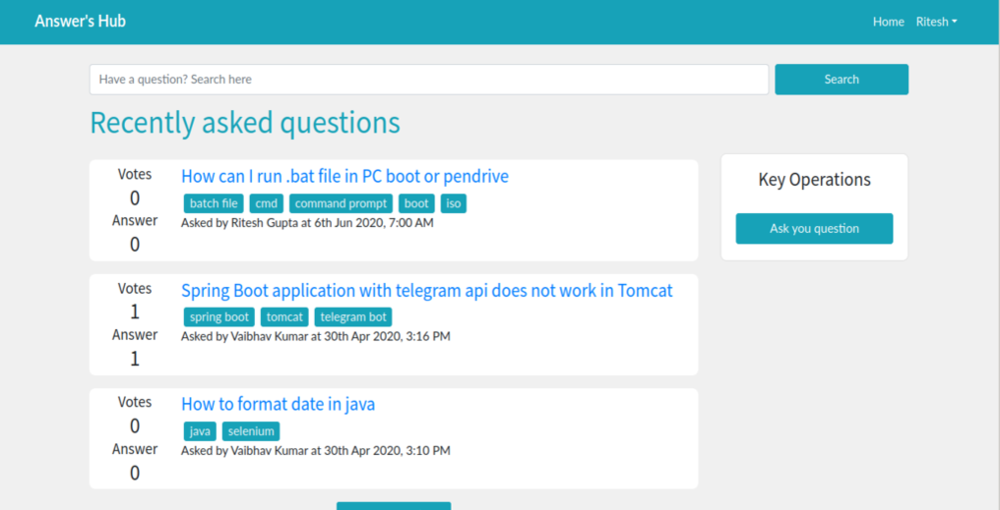
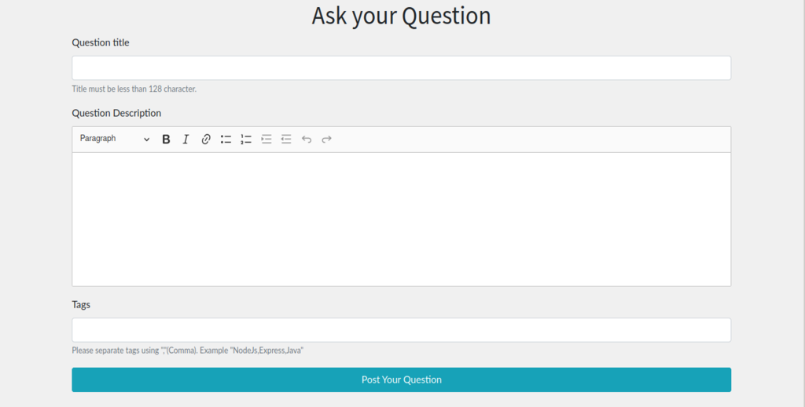
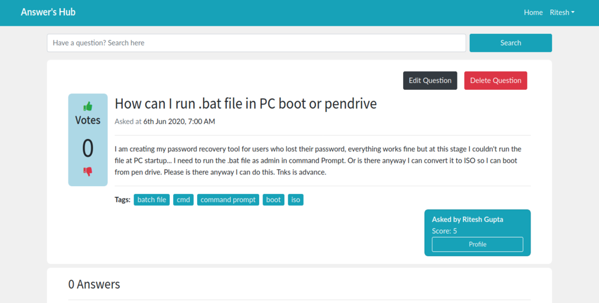
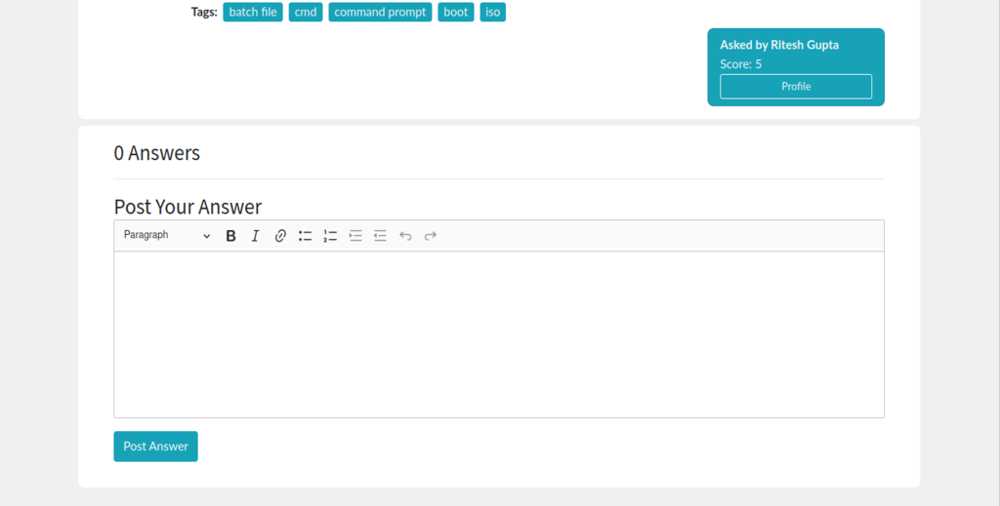
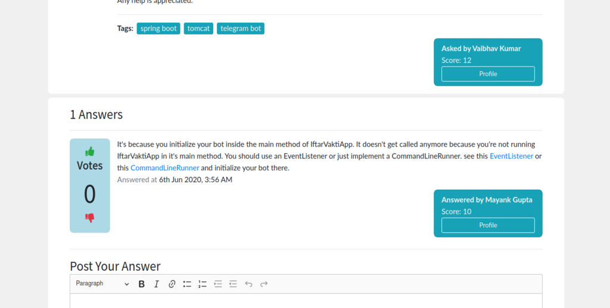

# Answer's Hub

> QnA Web Application for everyone

[Answer's Hub](https://answershub.herokuapp.com/ "Answer's Hub") is a Question and Answers web application that is developed using NodeJS, ReactJS with Redux and MongoDB. Users having question can post their question using this web application and other users can answer their questions. 

---

## Prerequisites

All need is NodeJS and npm installed on your machine. You can download nodejs from [here](https://nodejs.org/en/download/ "NodeJS Download")

---

## Quick Start 🚀

1. Add a .env file in the root folder with the following
```
MONGO_URI=<your mongodb uri with credentials>
JWT_SECRET=<your secret for Json Web Token>
SMTP_HOST=<your SMTP host>
SMTP_PORT=<your SMTP port>
SMTP_USER=<your SMTP user name>
SMTP_PASSWORD=<your SMTP password>
``` 


2. Install server dependencies

```bash
npm install
```

3. Install client dependencies

```bash
cd client
npm install
```

4. Run both Express & React from root folder

```bash
npm run dev
```

---

## Screenshots

### Home



### Post Question



### Question Display 



### Post Answer



### Answer Display



---

## Project information

### Author

[Vaibhav Kumar](https://github.com/vbk-dev/)

### Version

1.0.0

### Project Live link

[Answer's Hub](https://answershub.herokuapp.com/ "Answer's Hub")
